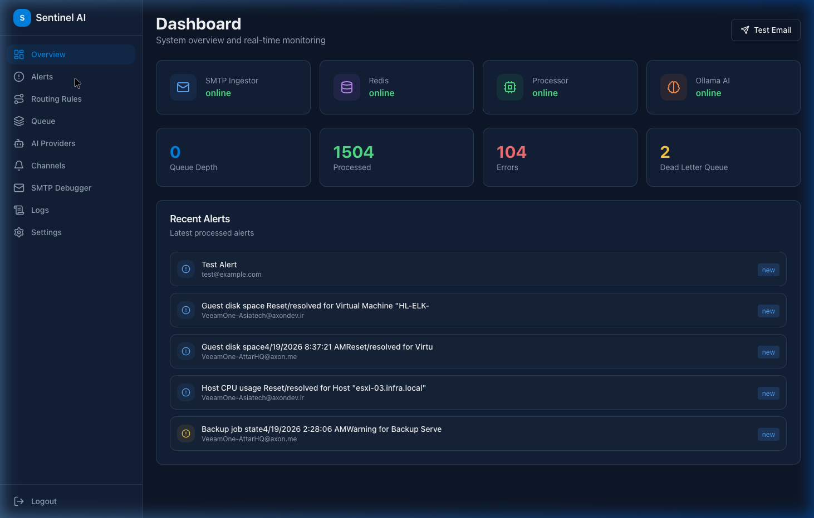
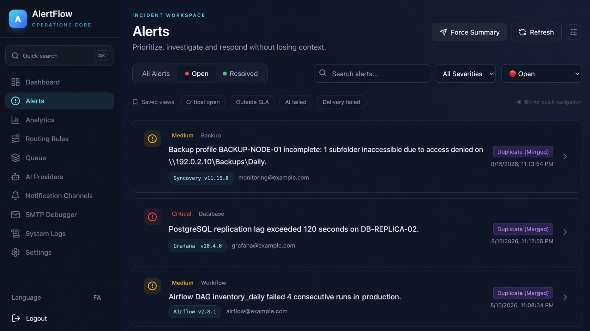
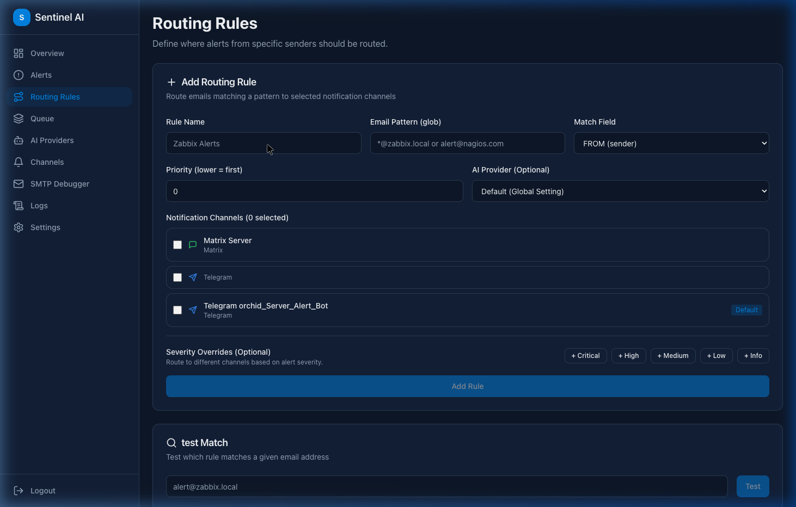

# AlertFlow

### Turn noisy infrastructure alerts into clear, correlated, actionable incidents.

[](https://fastapi.tiangolo.com/)
[](https://nextjs.org/)
[](https://redis.io/)
[](https://www.docker.com/)

AlertFlow is an open-source, AI-powered alert intelligence and incident-routing platform. It sits between monitoring systems and operations teams, converts raw email or webhook events into structured incidents, correlates related alerts, suppresses duplicates, and delivers the right context to the right channel.

Instead of asking on-call engineers to interpret hundreds of repetitive messages, AlertFlow gives them a concise summary, severity, affected resource, recommended actions, incident history, and current state—while preserving the option to run the AI layer on your own infrastructure.

## Why AlertFlow?

Monitoring tools are excellent at detecting symptoms. They are less effective at explaining what happened, connecting related events, or deciding who should be notified. The result is alert fatigue, fragmented incident context, repeated notifications, and slower response times.

AlertFlow transforms that workflow:

- Ingest alerts through SMTP or a secured HTTP webhook.
- Analyze unstructured content with any OpenAI-compatible model or local Ollama deployment.
- Correlate related events into a single evolving incident.
- Detect resolved states and update existing notifications automatically.
- Route incidents by sender, recipient, severity, channel, or custom rules.
- Track operational trends from a real-time multilingual dashboard.

## Product highlights

### AI incident intelligence

- Extracts severity, category, source host, affected resource, concise explanation, and recommended actions.
- Supports OpenAI-compatible APIs and self-hosted Ollama models.
- Uses fallback processing so an AI outage does not silently discard an alert.
- Reprocesses failed analyses and updates the existing notification after recovery.

### Intelligent correlation and noise reduction

- Groups repeated and related alerts into a single incident timeline.
- Suppresses duplicates while retaining occurrence counts and context.
- Recognizes recovery messages and automatically resolves matching incidents.
- Maintains action history for acknowledged, resolved, resent, and system-resolved events.

### Flexible routing and delivery

- Glob-based routing for sender and recipient addresses.
- Severity-specific overrides for critical escalation paths.
- Telegram, Matrix, generic webhook, and Kavenegar SMS delivery.
- Telegram topic/thread support, optional proxy mode, and message editing.
- Retry queues with exponential backoff and a dead-letter queue for failed deliveries.
- Scheduled Telegram summaries with configurable bot, chat, thread, time, and timezone.

### Operations-ready dashboard

- Live updates through Server-Sent Events without manual refreshes.
- Alert search, quick filters, status management, resend, and AI rerun controls.
- Analytics by status, severity, source, sender, and resolution state.
- Queue monitoring, application logs, provider health, routing previews, and test-email tools.
- Full English and Persian interface with locale-aware navigation.

### Security and deployment

- Password-protected Redis and configurable CORS policy.
- JWT authentication with bcrypt password hashing and legacy-hash migration.
- Token-protected webhook receiver with request-size limits.
- SMTP authentication and STARTTLS configuration.
- Docker Compose deployment using public base images and environment-driven configuration.

## See it in action



| Alert operations | Routing rules |
| --- | --- |
|  |  |

## Architecture

```text
 Monitoring systems                 External applications
 (Zabbix, Grafana, jobs)            (custom tools and services)
           │ SMTP                              │ HTTP webhook
           └──────────────┬────────────────────┘
                          ▼
                 Ingestion and validation
                          │
                          ▼
                   Redis message layer
                    ┌─────┴─────┐
                    ▼           ▼
             Alert processor   FastAPI
             AI + correlation  REST + SSE
                    │           │
                    ├─────┬─────┘
                    ▼     ▼
           Notification  Next.js dashboard
           channels
```

The project is composed of four independently deployable services:

| Service | Responsibility |
| --- | --- |
| `smtp-ingestor` | Receives email alerts and safely queues normalized messages. |
| `alert-processor` | Runs AI analysis, correlation, deduplication, state detection, and dispatch. |
| `api-server` | Exposes authenticated REST, webhook, analytics, health, and SSE endpoints. |
| `web-ui` | Provides the English/Persian operations and administration dashboard. |

Redis provides queues, retry state, incident data, configuration, logs, analytics counters, and real-time event coordination.

## Quick start

### Requirements

- Docker Engine with Docker Compose
- An OpenAI-compatible inference endpoint or Ollama instance
- At least one notification channel if you want external delivery

### 1. Clone and configure

```bash
git clone https://github.com/ChosoMeister/alertflow.git
cd alertflow
cp .env.example .env
```

Before starting, replace every `change_this_...` value in `.env`. At minimum, configure:

```env
REDIS_PASSWORD=use-a-long-random-password
JWT_SECRET=use-another-long-random-secret
WEBHOOK_AUTH_TOKEN=use-a-separate-random-token
OLLAMA_BASE_URL=http://host.docker.internal:11434/v1/chat/completions
OLLAMA_MODEL=your-model-name
CORS_ORIGINS=http://localhost:3000
```

Generate secrets with a tool such as `openssl rand -hex 32`; do not reuse the example values in production.

### 2. Start AlertFlow

```bash
docker compose up -d --build
```

Open:

- Dashboard: [http://localhost:3000](http://localhost:3000)
- API documentation: [http://localhost:8000/docs](http://localhost:8000/docs)
- Health endpoint: [http://localhost:8000/api/health](http://localhost:8000/api/health)

The initial local accounts are `admin/admin` and `operator/operator`. Change these passwords immediately from Settings before exposing the application to any network.

### 3. Send alerts

Point a monitoring tool at the SMTP listener on port `25`, or send a JSON payload to the webhook endpoint with your configured token:

```bash
curl -X POST http://localhost:8000/api/webhook/grafana \
  -H "Content-Type: application/json" \
  -H "X-Webhook-Token: $WEBHOOK_AUTH_TOKEN" \
  -d '{
    "subject": "Database latency is above threshold",
    "body": "p95 latency exceeded 800ms for five minutes",
    "status": "firing"
  }'
```

## Configuration

The checked-in [.env.example](.env.example) documents the supported environment variables. Runtime settings for AI providers, notification channels, routing, severity overrides, daily summaries, and account passwords can also be managed from the dashboard.

For public deployments, place the dashboard and API behind a TLS-terminating reverse proxy, restrict exposed ports, use strong unique secrets, and set an explicit `CORS_ORIGINS` value.

## Development

Run the Python services with their individual requirements files. For the web dashboard:

```bash
cd web-ui
npm ci
npm run dev
```

Production build:

```bash
npm run build
```

End-to-end tests are located in `web-ui/tests` and use Playwright:

```bash
npm run test:e2e
```

## فارسی

### هشدار کمتر، درک بهتر، واکنش سریع‌تر

AlertFlow یک پلتفرم متن‌باز برای تحلیل، همبستگی و مسیریابی هوشمند هشدارهای زیرساختی است. این محصول ایمیل‌ها و webhookهای خام ابزارهایی مانند Zabbix، Grafana، سامانه‌های پشتیبان‌گیری و jobهای زمان‌بندی‌شده را دریافت می‌کند و آن‌ها را به رخدادهایی قابل‌فهم و قابل‌پیگیری تبدیل می‌کند.

با AlertFlow تیم عملیات به‌جای خواندن پیام‌های تکراری و طولانی، خلاصه مشکل، شدت رخداد، منبع، تجهیز یا سرویس درگیر، راهکارهای پیشنهادی و تاریخچه کامل وضعیت را در تلگرام، Matrix، webhook، پیامک یا داشبورد مشاهده می‌کند.

قابلیت‌های کلیدی:

- تحلیل هشدار با مدل‌های OpenAI-compatible یا Ollama داخلی
- تجمیع هشدارهای مرتبط و جلوگیری از اعلان‌های تکراری
- تشخیص پیام‌های بازیابی و بستن خودکار رخداد
- مسیریابی بر اساس فرستنده، گیرنده، شدت و قوانین سفارشی
- ارسال و ویرایش اعلان در Telegram، Matrix، webhook و SMS
- صف retry، backoff تصاعدی و dead-letter queue
- خلاصه روزانه قابل تنظیم در تلگرام
- داشبورد زنده، گزارش‌های تحلیلی و تاریخچه اقدامات
- رابط کاربری کامل فارسی و انگلیسی
- دریافت هشدار از SMTP و webhook امن

AlertFlow برای تیم‌هایی ساخته شده که کنترل داده، امکان اجرای داخلی، انعطاف در اتصال به ابزارهای موجود و کاهش واقعی alert fatigue برایشان مهم است.

## Contributing

Issues and pull requests are welcome. For substantial changes, open an issue first so the design and operational impact can be discussed.
