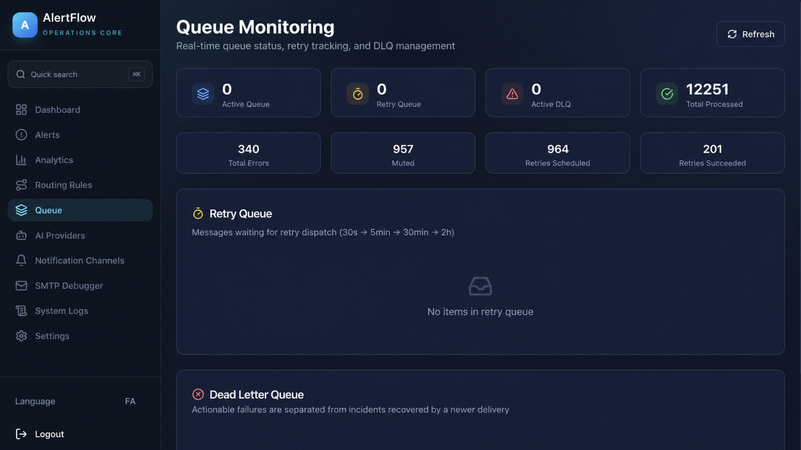

# AlertFlow

### Self-hosted AI alert intelligence, incident correlation, and reliable multi-destination delivery.

[](VERSION)
[](https://www.python.org/)
[](https://fastapi.tiangolo.com/)
[](https://nextjs.org/)
[](https://redis.io/)
[](https://docs.docker.com/compose/)

**English** · [فارسی](#معرفی-alertflow)

AlertFlow is an open-source operations platform that turns noisy monitoring events into structured, correlated, and actionable incidents. It accepts alerts over SMTP and authenticated webhooks, analyzes them through local or remote OpenAI-compatible models, and delivers the right message to Telegram, Matrix, SMS, or generic webhooks.

It sits between monitoring systems and responders:

```text
Zabbix / Grafana / Backup / Security / Custom systems
                         │
                   SMTP or Webhook
                         ▼
          Durable queue → AI analysis → Correlation
                         │
              Routing + delivery policies
                         ▼
             Telegram / Matrix / SMS / Webhook
```

AlertFlow does not replace your monitoring or ITSM stack. It adds an intelligence and delivery layer that reduces duplicate noise, maintains incident history, explains what changed, and makes notification delivery observable and recoverable.

## Why engineering teams use AlertFlow

- **Reduce alert fatigue:** exact deduplication, incident correlation, storm control, and notification updates keep repeated events together.
- **Get evidence-grounded analysis:** extract severity, state, affected resource, technical facts, and remediation steps while validating model claims against the source alert.
- **Keep operational data under control:** self-host the entire stack and use Ollama, vLLM, or another OpenAI-compatible endpoint.
- **Route with precision:** match sender or recipient patterns, select a model per rule, and assign different destinations by severity.
- **Deliver reliably:** destination-specific retries, dead-letter queues, circuit breakers, and revision tracking prevent one failed channel from blocking the rest.
- **Operate from one control plane:** inspect alerts, incidents, analytics, providers, routing, queues, logs, and health from a bilingual real-time dashboard.

## Product tour

### Real-time operations overview


Live counters, severity distribution, processing rate, incident status, recent alerts, source activity, and service health provide an immediate operational picture.

### Alert investigation and incident history


Inspect the original event, normalized fields, AI result, routing outcome, lifecycle state, timestamps, and related occurrences without searching across multiple systems.

### Routing policy management


Manage ordered matching rules, AI-provider selection, default destinations, severity overrides, and resolution behavior from the UI.

### Retry queue and dead-letter operations



Track pending retries, failed destinations, next-attempt times, and dead-letter items; then retry or investigate failures without replaying successful deliveries.

> Screenshots use anonymized demonstration data derived from the real AlertFlow interface.

## How the pipeline works

```text
1. Ingest          2. Normalize        3. Analyze          4. Correlate
SMTP/Webhook  ──►  Redis Stream  ──►   AI + validation ─► NEW/UPDATE/RESOLVE
                                                               │
8. Observe         7. Recover          6. Deliver          5. Route
Dashboard/SSE ◄──  Retry + DLQ   ◄──   Destinations   ◄── Rules + snapshots
```

Every accepted message receives a trace ID and enters the same durable processing path. This gives email-only tools and webhook-native systems identical correlation, routing, retry, and audit behavior.

## Core capabilities

### Durable SMTP and webhook ingestion

- An asynchronous `aiosmtpd` service parses SMTP envelopes, recipients, text, and HTML bodies.
- `POST /api/webhook/{source_name}` accepts JSON or plain text with `X-Webhook-Token` authentication and a 512 KB request limit.
- Normalized events are appended to the Redis Stream `alerts:stream`.
- The `alert-processors` consumer group supports acknowledgment, pending-entry recovery, and idle-message reclaim after processor restarts.
- Redis AOF persistence and a `noeviction` policy protect queued operational state.

### Noise reduction and storm control

AlertFlow applies two complementary controls:

1. **Exact deduplication** hashes the sender, normalized subject, and first 200 body characters. Matching events are suppressed within a rolling 30-minute window.
2. **Incident correlation** compares deterministic source/resource identity and relevant open incidents to classify an event as `NEW`, `UPDATE`, or `RESOLVE`.

Repeated updates increment the incident occurrence count and can edit the existing Telegram or Matrix notification. Recovery events close the matching incident instead of creating a disconnected “resolved” alert. Ambiguous or stale events are retained with explicit lifecycle states rather than silently discarded.

### Multi-provider AI with evidence validation

AlertFlow calls OpenAI-compatible `/chat/completions` endpoints and works with Ollama, vLLM, hosted APIs, or compatible gateways. Providers are managed through the UI/API, routes may select a preferred provider, and a bounded fallback chain tries alternate providers when necessary.

Optional source adapters normalize known monitoring formats before inference. The model returns a structured operational contract:

```json
{
  "analysis": {
    "severity": "Critical | High | Medium | Low | Info",
    "category": "Backup | Database | Network | Security | Service | Storage | Other",
    "status": "FIRING | RESOLVED | INFO",
    "action": "NEW | UPDATE | RESOLVE",
    "target_incident_id": "incident UUID or empty",
    "confidence": 0.95,
    "system_name": "source system",
    "source_host": "originating host",
    "target_resource": "affected component",
    "main_message": "one-sentence diagnosis",
    "details": ["source-supported technical fact"],
    "recommended_actions": [
      {"title": "Verify service state", "command": "systemctl status example"}
    ],
    "emoji": "🔴"
  }
}
```

The processor validates resource, storage, state, and remediation claims against the original event. Unsupported claims are removed or downgraded. If every provider fails, AlertFlow can still send a redacted raw fallback without inventing an incident.

Defaults are tuned for operational safety: `AI_BODY_MAX_CHARS=2500`, `AI_MAX_PROVIDER_ATTEMPTS=3`, and a 120-second provider timeout. All are configurable.

### Incident lifecycle and notification continuity

```text
NEW ──► OPEN incident
          │
UPDATE ──┤ occurrence count + history + message revision
          │
RESOLVE ─┴─► CLOSED incident + final notification state
```

Incident state includes indexed event history, routing snapshots, per-destination revisions, and outbound message IDs. This lets AlertFlow update the original Telegram or Matrix card as an incident evolves while protecting it from later rule changes. `ORPHAN` and `STALE` states make correlation edge cases visible to operators.

### Connector → Destination → Rule routing model

AlertFlow separates secrets, endpoints, and business policy:

| Object | Responsibility | Examples |
| --- | --- | --- |
| Connector | Write-only transport credentials | Telegram bot token, Matrix access token, webhook authorization |
| Destination | Reusable endpoint coordinates | chat/thread, Matrix room, webhook URL, SMS receptor |
| Rule | Match and delivery policy | sender/recipient glob, provider, default/severity/resolution destinations |

Rules run by ascending priority and match SMTP `from` or envelope `to` values using case-insensitive glob patterns:

```text
alert@monitoring.local
*@database.example
security-*@example.com
```

Each rule can define default alert destinations, optional severity-specific destinations, resolved destinations, and a preferred AI provider. Resolution policies support:

- `legacy`: update the active notification in place;
- `copy`: publish a complete resolution card while preserving the active message;
- `move`: publish the resolution card, then remove or tombstone the active message.

Use `/api/routing-rules/test-match` and `/api/test-email/preview` to validate behavior before production traffic is sent.

### Reliable multi-channel delivery

| Transport | Capabilities |
| --- | --- |
| Telegram | New message, thread/topic targeting, revision-aware edit, resolution workflow |
| Matrix | Room delivery, revision-aware edit, resolution workflow |
| Generic webhook | Structured JSON delivery with reusable authentication headers |
| Kavenegar SMS | Compact high-priority notification delivery |

Failures are recorded per destination. Successful destinations are never replayed simply because another target failed. Retry delays are scheduled at 30 seconds, 5 minutes, 30 minutes, and 2 hours; exhausted jobs move to the dead-letter queue. Circuit breakers isolate unhealthy transports, and revision checks prevent an old retry from overwriting a newer incident state.

## Architecture

| Component | Technology | Responsibility |
| --- | --- | --- |
| `smtp-ingestor` | Python, aiosmtpd | Accept and normalize email alerts |
| `alert-processor` | Python, asyncio | Deduplicate, analyze, correlate, route, and dispatch |
| `api-server` | FastAPI | REST API, authentication, webhook ingest, health, and SSE |
| `web-ui` | Next.js, TypeScript | Responsive English/Persian operations dashboard |
| `redis` | Redis 7 | Streams, state, configuration, retries, DLQ, and persistence |
| `alloy` / `loki` | Grafana stack | Optional centralized log collection and querying |

The services are independently restartable and communicate through Redis-backed state. The default Compose stack runs Redis with AOF, a 512 MB memory ceiling, and `noeviction` so configuration or queued work is not silently discarded.

## Operations and observability

- Real-time Server-Sent Events without exposing JWTs in query strings
- Health and readiness endpoints for the API and supporting services
- Dashboard analytics for volume, severity, sources, delivery, and incident state
- Searchable application logs with optional Alloy/Loki aggregation
- Queue depth, retry schedule, attempt history, and dead-letter visibility
- Provider, connector, destination, and rule testing from the control plane
- Bilingual English/Persian UI with RTL support

## Security model

- Session tokens are stored in secure, HTTP-only cookies.
- Connector secrets are write-only and are not returned by API reads.
- Webhook ingestion requires a per-source token.
- Alert previews and fallback messages redact common credential patterns.
- Routing tests and email previews allow policy validation before live delivery.
- The stack is intended to run behind a TLS reverse proxy with network access controls.

For production, replace bootstrap credentials, use long random secrets, keep Redis private, restrict SMTP and API exposure, enable TLS, and rotate every connector/provider credential inherited from another environment.

## Quick start

### Requirements

- Docker Engine 24+
- Docker Compose v2
- At least 2 GB RAM; 4 GB recommended when running a local model separately
- An OpenAI-compatible model endpoint and at least one notification destination

### Start the stack

```bash
git clone https://github.com/ChosoMeister/alertflow.git
cd alertflow
cp .env.example .env
docker compose up -d --build
docker compose ps
```

Open `http://localhost:3000`.

Bootstrap accounts are provided only for the first login:

```text
admin / admin
operator / operator
```

Change both passwords immediately. `COOKIE_SECURE=false` is acceptable only for local HTTP evaluation; production deployments should use HTTPS and `COOKIE_SECURE=true`.

Configure the first AI provider, connector, destination, and routing rule from the dashboard. Then send a test event and confirm its processing, correlation, route, and delivery outcome in the Alerts view.

### Send a webhook alert

```bash
curl -X POST http://localhost:8000/api/webhook/demo \
  -H 'Content-Type: application/json' \
  -H 'X-Webhook-Token: replace-with-your-source-token' \
  -d '{
    "title": "Database connection saturation",
    "status": "firing",
    "host": "db-node-01",
    "value": 97
  }'
```

### Upgrade destination-only routing

When upgrading an installation created before v2.11.0, preview and apply the included migration:

```bash
docker compose run --rm alert-processor \
  python scripts/migrate_rules_destination_only.py

docker compose run --rm alert-processor \
  python scripts/migrate_rules_destination_only.py --apply
```

Run the first command as a dry run, review the result, back up Redis, and only then use `--apply`.

## Production checklist

- Put the UI/API behind a TLS reverse proxy.
- Set unique application, webhook, provider, and connector secrets.
- Keep Redis on a private network and persist its data volume.
- Restrict SMTP ingress to approved monitoring systems.
- Back up Redis and test restore procedures.
- Configure log retention and monitor retry/DLQ growth.
- Test every severity and resolution route before enabling production traffic.
- Verify local-model capacity, timeouts, and fallback providers under load.

## Current boundaries

- Redis is the operational datastore; external SQL databases are not currently required.
- Telegram and Matrix support message continuity; webhook and SMS transports are append-only by nature.
- Correlation quality depends on the source format and model, so deterministic identity and evidence validation remain part of the pipeline.
- The bundled Compose deployment is single-site; multi-region orchestration is outside the current scope.

## Documentation and development

- [Deployment and operations](docs/deployment-and-operations.md)
- [Architecture](docs/architecture.md)
- [API reference](docs/api-reference.md)
- [Routing and notifications](docs/routing-and-notifications.md)
- [Observability runbook](docs/observability-runbook.md)

Useful validation commands:

```bash
python -m compileall -q services scripts migrations tests
docker compose --env-file .env.example config --quiet
cd web-ui && npm ci && npm run build
```

Contributions are welcome. Please include tests, update the relevant documentation, and avoid committing credentials, internal hostnames, or real alert data.

---

# معرفی AlertFlow

### پلتفرم متن‌باز و Self-hosted برای تحلیل هوشمند هشدار، هم‌بستگی رخداد و ارسال مطمئن اعلان‌ها

AlertFlow برای تیم‌های فنی، NOC، SRE، DevOps و زیرساخت ساخته شده است. این سامانه هشدارها را از SMTP یا Webhook دریافت می‌کند، آن‌ها را در یک صف پایدار قرار می‌دهد، با مدل‌های سازگار با OpenAI تحلیل می‌کند، رخدادهای مرتبط را داخل یک Incident نگه می‌دارد و خروجی مناسب را به Telegram، Matrix، پیامک یا Webhook می‌فرستد.

مسئله‌ای که AlertFlow حل می‌کند فقط «ارسال هشدار» نیست. خروجی سامانه مانیتورینگ معمولاً تکراری، پراکنده و فاقد زمینه عملیاتی کافی است. AlertFlow این خروجی را به یک رکورد ساخت‌یافته تبدیل می‌کند که شدت، وضعیت، منبع، سرویس یا منبع آسیب‌دیده، شواهد فنی، اقدام پیشنهادی و تاریخچه تغییرات Incident را در خود دارد.

AlertFlow جایگزین Zabbix، Grafana، Prometheus یا ITSM نیست؛ لایه هوشمند میان تولیدکننده هشدار و تیم پاسخ‌گو است.

## چه چیزی در اختیار تیم فنی قرار می‌گیرد؟

- **کاهش Alert Fatigue:** تشخیص هشدار دقیقاً تکراری، هم‌بستگی رخدادها، کنترل Storm و به‌روزرسانی پیام قبلی به‌جای تولید اعلان‌های جداگانه.
- **تحلیل قابل اتکا:** استخراج Severity، وضعیت، منبع درگیر، شواهد و اقدام اصلاحی همراه با کنترل ادعاهای مدل در برابر متن اصلی هشدار.
- **مالکیت داده:** اجرای کامل Stack در زیرساخت خودتان و امکان استفاده از Ollama، vLLM یا هر API سازگار با OpenAI.
- **مسیریابی دقیق:** Match روی فرستنده یا گیرنده، انتخاب Provider برای هر Rule و تعیین مقصدهای متفاوت بر اساس Severity.
- **ارسال مقاوم در برابر خطا:** Retry مستقل برای هر مقصد، Dead-letter Queue، Circuit Breaker و جلوگیری از بازنویسی وضعیت جدید با Retry قدیمی.
- **کنترل‌پنل عملیاتی:** مشاهده Alert، Incident، Analytics، Queue، Log، Provider، Connector، Destination، Rule و Health در رابط دوزبانه و Real-time.

## نمای محصول

### داشبورد لحظه‌ای عملیات


شاخص‌های حجم پردازش، توزیع شدت، Incidentهای باز، منابع فعال، آخرین هشدارها و سلامت سرویس‌ها در یک نما دیده می‌شوند.

### بررسی فنی هشدار و تاریخچه Incident


متن ورودی، فیلدهای نرمال‌شده، نتیجه AI، مسیر ارسال، وضعیت چرخه عمر و رخدادهای مرتبط کنار هم قابل بررسی هستند.

### مدیریت Rule و سیاست ارسال


Ruleهای اولویت‌دار، Provider، مقصد پیش‌فرض، Override بر اساس Severity و رفتار اعلان Resolution از داخل UI مدیریت می‌شوند.

### Retry Queue و Dead-letter Queue


خطای هر مقصد، زمان تلاش بعدی و آیتم‌های DLQ قابل مشاهده‌اند؛ در نتیجه برای رفع یک مقصد ناموفق نیازی به ارسال دوباره اعلان‌های موفق نیست.

> داده‌های موجود در تصاویر نمایشی و ناشناس‌سازی شده‌اند و از رابط واقعی AlertFlow تهیه شده‌اند.

## جریان پردازش

```text
دریافت SMTP/Webhook
        │
        ▼
نرمال‌سازی و Redis Stream
        │
        ▼
تحلیل AI و اعتبارسنجی شواهد
        │
        ▼
Deduplication و Correlation
        │
        ▼
NEW / UPDATE / RESOLVE
        │
        ▼
Routing → Delivery → Retry/DLQ → Dashboard
```

تمام ورودی‌های پذیرفته‌شده Trace ID می‌گیرند و از یک Pipeline مشترک عبور می‌کنند؛ بنابراین ورودی ایمیل و Webhook رفتار یکسانی در تحلیل، هم‌بستگی، ارسال و Audit دارند.

## جزئیات فنی قابلیت‌ها

### دریافت پایدار هشدار

- سرویس Async مبتنی بر `aiosmtpd`، Envelope، گیرنده‌ها و بدنه Text/HTML ایمیل را استخراج می‌کند.
- مسیر `POST /api/webhook/{source_name}` داده JSON یا متن ساده را با هدر `X-Webhook-Token` و سقف ۵۱۲ کیلوبایت دریافت می‌کند.
- رخداد نرمال‌شده وارد Redis Stream با نام `alerts:stream` می‌شود.
- Consumer Group با نام `alert-processors` از ACK، بازیابی Pending Entry و Reclaim پیام‌های بدون مصرف پس از Restart پشتیبانی می‌کند.
- AOF و سیاست `noeviction` از حذف بی‌صدای Queue و State جلوگیری می‌کنند.

### کنترل نویز و هم‌بستگی رخداد

AlertFlow دو لایه مستقل دارد:

1. **Exact Deduplication:** از فرستنده، Subject نرمال‌شده و ۲۰۰ کاراکتر نخست بدنه Hash می‌سازد و تکرار دقیق را در پنجره ۳۰ دقیقه‌ای حذف می‌کند.
2. **Incident Correlation:** هویت قطعی Source/Resource و Incidentهای باز مرتبط را بررسی می‌کند تا رخداد `NEW`، `UPDATE` یا `RESOLVE` تشخیص داده شود.

در UPDATE، شمارنده و History به‌روزرسانی می‌شوند و پیام موجود Telegram یا Matrix می‌تواند Edit شود. در RESOLVE همان Incident بسته می‌شود. وضعیت‌های `ORPHAN` و `STALE` نیز باعث می‌شوند حالت‌های مبهم به‌جای حذف شدن برای اپراتور قابل مشاهده باشند.

### تحلیل AI چندارائه‌دهنده و مبتنی بر شواهد

Providerها از API سازگار با OpenAI استفاده می‌کنند؛ بنابراین Ollama، vLLM، سرویس Hosted یا Gateway داخلی قابل استفاده است. برای هر Rule می‌توان Provider ترجیحی تعریف کرد و در صورت خطا، زنجیره Fallback محدود به Providerهای دیگر می‌رود.

خروجی مدل یک JSON ساخت‌یافته شامل Severity، Category، Status، Action، Confidence، System، Source Host، Target Resource، پیام اصلی، جزئیات فنی و اقدام‌های پیشنهادی است. سپس Processor ادعاهای مربوط به منبع، Storage، Status و راهکار را با متن اصلی کنترل می‌کند. موارد بدون شاهد حذف یا کم‌اعتبار می‌شوند. اگر تمام Providerها از دسترس خارج شوند، سامانه می‌تواند متن خام Redact‌شده را ارسال کند بدون آن‌که Incident ساختگی بسازد.

### معماری مسیریابی Connector → Destination → Rule

این مدل Secret، Endpoint و Policy را از هم جدا می‌کند:

| جزء | مسئولیت | نمونه |
| --- | --- | --- |
| Connector | اطلاعات محرمانه و Write-only انتقال | Bot Token، Matrix Token، هدر Authorization |
| Destination | آدرس قابل استفاده مجدد | Chat/Thread، Room، URL، شماره گیرنده |
| Rule | شرط و سیاست ارسال | Glob فرستنده/گیرنده، Provider، مقصد Severity و Resolution |

Ruleها بر اساس Priority اجرا می‌شوند و با Glob بدون حساسیت به حروف روی `from` یا `to` تطبیق پیدا می‌کنند. هر Rule مقصد پیش‌فرض، مقصد اختصاصی Severity، مقصد Resolution و Provider ترجیحی دارد. Snapshot مقصدها هنگام باز شدن Incident ثبت می‌شود تا تغییر بعدی Rule هویت پیام‌های قبلی را جابه‌جا نکند.

برای Resolution سه سیاست وجود دارد:

- `legacy`: ویرایش اعلان فعال در همان محل؛
- `copy`: ارسال کارت کامل Resolution و حفظ پیام فعال؛
- `move`: ارسال کارت Resolution و سپس حذف یا Tombstone کردن پیام فعال.

پیش از ورود ترافیک واقعی می‌توان رفتار Rule را با `/api/routing-rules/test-match` و پیش‌نمایش ایمیل را با `/api/test-email/preview` آزمایش کرد.

### تحویل مقاوم و قابل بازیابی

Telegram، Matrix، Webhook عمومی و Kavenegar SMS پشتیبانی می‌شوند. شکست هر Destination به‌صورت مستقل ثبت می‌شود و مقصدهای موفق دوباره ارسال نمی‌شوند. Retryها به‌ترتیب پس از ۳۰ ثانیه، ۵ دقیقه، ۳۰ دقیقه و ۲ ساعت اجرا می‌شوند و پس از پایان تلاش‌ها به DLQ می‌روند. Circuit Breaker کانال ناسالم را ایزوله می‌کند و Revision Check مانع می‌شود یک Retry قدیمی وضعیت جدید Incident را بازنویسی کند.

## اجزای سامانه

| سرویس | فناوری | وظیفه |
| --- | --- | --- |
| `smtp-ingestor` | Python / aiosmtpd | دریافت و نرمال‌سازی ایمیل |
| `alert-processor` | Python / asyncio | Dedup، AI، Correlation، Routing و Dispatch |
| `api-server` | FastAPI | REST، Auth، Webhook، Health و SSE |
| `web-ui` | Next.js / TypeScript | داشبورد Responsive فارسی و انگلیسی |
| `redis` | Redis 7 | Stream، State، Config، Retry، DLQ و Persistence |
| `alloy` / `loki` | Grafana stack | جمع‌آوری و جست‌وجوی اختیاری Log |

## راه‌اندازی سریع

پیش‌نیازها: Docker Engine 24+، Docker Compose v2، حداقل ۲ گیگابایت RAM و یک Endpoint سازگار با OpenAI.

```bash
git clone https://github.com/ChosoMeister/alertflow.git
cd alertflow
cp .env.example .env
docker compose up -d --build
docker compose ps
```

سپس `http://localhost:3000` را باز کنید. حساب‌های Bootstrap فقط برای ورود اولیه هستند:

```text
admin / admin
operator / operator
```

رمز هر دو حساب را فوراً تغییر دهید. مقدار `COOKIE_SECURE=false` فقط برای تست HTTP محلی مناسب است؛ در محیط Production از HTTPS و `COOKIE_SECURE=true` استفاده کنید.

در UI ابتدا AI Provider، سپس Connector، Destination و Rule را بسازید. بعد یک Test Alert ارسال کنید و نتیجه پردازش، Correlation، Route و Delivery را در بخش Alerts کنترل کنید.

### نمونه Webhook

```bash
curl -X POST http://localhost:8000/api/webhook/demo \
  -H 'Content-Type: application/json' \
  -H 'X-Webhook-Token: replace-with-your-source-token' \
  -d '{
    "title": "Database connection saturation",
    "status": "firing",
    "host": "db-node-01",
    "value": 97
  }'
```

## نکات Production

- UI و API را پشت Reverse Proxy با TLS قرار دهید.
- تمام Passwordها، Tokenها و Secretهای اولیه را تغییر دهید.
- Redis را روی شبکه Private نگه دارید و از Volume آن Backup بگیرید.
- دسترسی SMTP را به سیستم‌های مانیتورینگ مجاز محدود کنید.
- رشد Retry/DLQ، ظرفیت مدل، Timeout و Providerهای Fallback را مانیتور کنید.
- تمام مسیرهای Severity و Resolution را پیش از فعال‌سازی Production آزمایش کنید.

## محدودیت‌های فعلی

- Redis دیتابیس عملیاتی سامانه است و در معماری فعلی SQL خارجی لازم نیست.
- تداوم و Edit پیام برای Telegram و Matrix وجود دارد؛ SMS و Webhook ماهیت Append-only دارند.
- کیفیت Correlation به ساختار Source و مدل وابسته است؛ به همین دلیل هویت قطعی و Evidence Validation بخشی از Pipeline باقی مانده‌اند.
- Compose فعلی برای استقرار Single-site طراحی شده و Multi-region Orchestration در محدوده نسخه فعلی نیست.

## مشارکت در توسعه

Issue و Pull Request پذیرفته می‌شود. تغییرات باید Test مناسب و مستندات به‌روز داشته باشند. هیچ Credential، Hostname داخلی یا نمونه Alert واقعی را Commit نکنید.

برای جزئیات بیشتر، [استقرار و عملیات](docs/deployment-and-operations.md)، [معماری](docs/architecture.md)، [مرجع API](docs/api-reference.md)، [مسیریابی و اعلان‌ها](docs/routing-and-notifications.md) و [راهنمای Observability](docs/observability-runbook.md) را ببینید.
